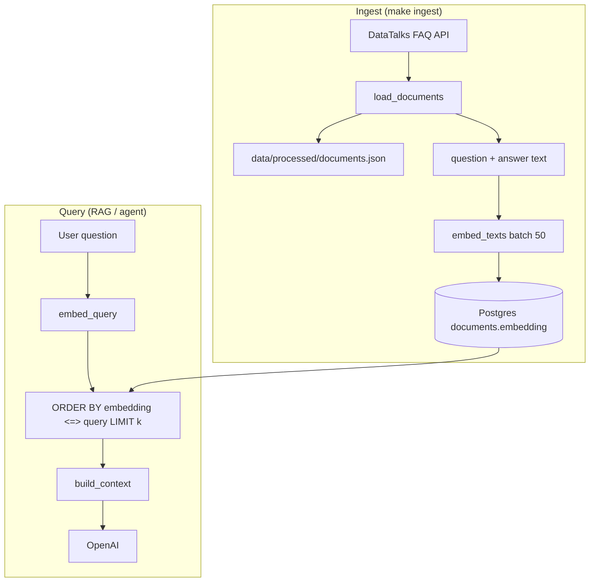
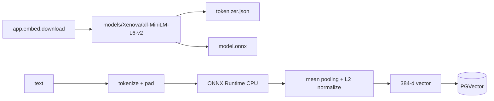
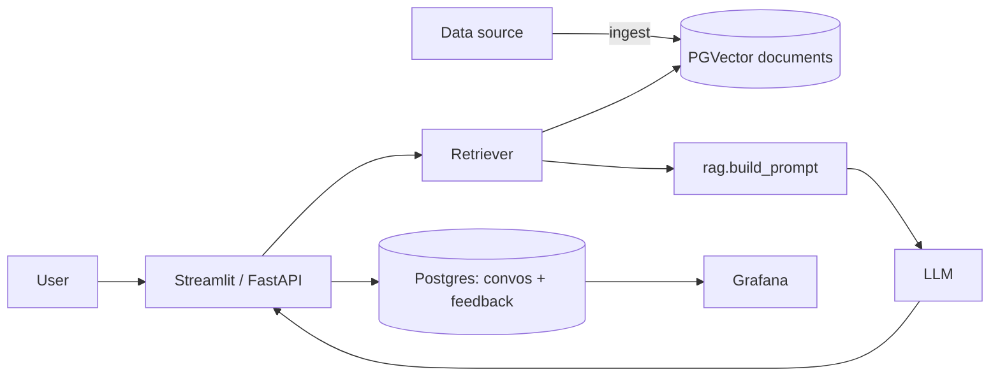

# Architecture

## Components

| Component | Module | Responsibility |
|-----------|--------|----------------|
| Ingestion (`app/ingest.py`) | 1, 3 | Download FAQ JSON, save cache, call PGVector indexing |
| Embeddings (`app/embeddings.py`, `app/embed/`) | 2, 9 | ONNX `Xenova/all-MiniLM-L6-v2` (384-d); optional PyTorch backend |
| Knowledge base (`app/retrieval/pgvector_store.py`) | 2 | Postgres `documents` table + `vector` extension + HNSW |
| Vector retrieval (`app/retrieval/vector.py`) | 2 | Cosine search via `<=>`, filter by `course` |
| Keyword retrieval (`app/retrieval/keyword.py`) | 1 | In-memory minsearch (no Postgres) |
| Hybrid (`app/retrieval/hybrid.py`) | 6 | Fuse keyword + vector (TODO) |
| RAG (`app/rag.py`) | 1 | Retrieve → prompt → LLM |
| Interface (`app/api.py`, `app/ui.py`) | 5, 7 | FastAPI + Streamlit |
| Storage (`app/db.py`) | 5 | Conversations + feedback (separate tables, TODO) |
| Monitoring (`grafana/`) | 5 | Dashboards over Postgres |

## PGVector workflow

1. **Download** — `ingest.load_documents()` fetches course list + per-course FAQ JSON.
2. **Cache** — `save_documents()` writes `data/processed/documents.json` for reproducibility.
3. **Schema** — `pgvector_store.init_schema()` enables `vector`, creates `documents(embedding vector(384))`.
4. **Embed + load** — `VectorRetriever.index()` encodes each doc and `insert_documents()` bulk-inserts.
5. **Index** — `create_hnsw_index()` adds approximate nearest-neighbor search for scale.
6. **Search** — `VectorRetriever.search()` embeds the query, runs cosine distance (`<=>`), filters `course`.

Reference: [LLM Zoomcamp — Vector Search with PGVector](https://github.com/DataTalksClub/llm-zoomcamp/blob/main/02-vector-search/lessons/08-pgvector.md).

## ONNX embedder workflow

Per [09-onnx-embedder.md](https://github.com/DataTalksClub/llm-zoomcamp/blob/main/02-vector-search/lessons/09-onnx-embedder.md): same model family as `sentence-transformers`, ~33× smaller deploy footprint (no PyTorch).

| Symbol | File | Purpose |
|--------|------|---------|
| `Embedder` | `embed/onnx_embedder.py` | Tokenize → ONNX infer → mean pool → normalize |
| `download()` | `embed/download.py` | Fetch `tokenizer.json` + `model.onnx` from HuggingFace |
| `get_embedder()` | `embeddings.py` | Returns `Embedder` when `EMBEDDING_BACKEND=onnx` (default) |
| `EMBEDDING_BACKEND` | `config.py` | `onnx` (default) or `torch` (needs `--extra torch-embeddings`) |

## Module reference

| Symbol | File | Purpose |
|--------|------|---------|
| `get_embedder()` | `embeddings.py` | Lazy-load `SentenceTransformer` once |
| `document_text()` | `embeddings.py` | Concatenate question + answer for embedding |
| `embed_texts()` / `embed_query()` | `embeddings.py` | Batch index encoding vs single query encoding |
| `vec_to_str()` | `embeddings.py` | Format float list as Postgres `vector` literal |
| `connect()` | `pgvector_store.py` | `psycopg2` connection from `POSTGRES_*` env |
| `init_schema()` | `pgvector_store.py` | Extension + table; optional `DROP` on re-ingest |
| `insert_documents()` | `pgvector_store.py` | Persist rows with `%s::vector` cast |
| `create_hnsw_index()` | `pgvector_store.py` | Speed up ANN search at scale |
| `search_documents()` | `pgvector_store.py` | SQL similarity search filtered by course |
| `VectorRetriever.index/search` | `vector.py` | Retriever API used by ingest and `rag()` |
| `index_pgvector()` | `ingest.py` | Orchestrates indexing from CLI / Makefile |

## End-to-end flow

## Decisions

- **PGVector in Postgres** — Same database as monitoring tables; concurrent access, transactions, production-friendly vs in-memory minsearch-only vectors.
- **Model `Xenova/all-MiniLM-L6-v2` (ONNX)** — 384 dimensions; ONNX export of `all-MiniLM-L6-v2`; matches `vector(384)` column.
- **Default backend ONNX** — Production path without PyTorch; set `EMBEDDING_BACKEND=torch` for the original `sentence-transformers` dev workflow.
- **Cosine distance** — `ORDER BY embedding <=> query`; operator from [pgvector](https://github.com/pgvector/pgvector).
- **Course filter** — `WHERE course = %s` keeps retrieval scoped (default `llm-zoomcamp`).
- **HNSW index** — Built after full ingest; trade-off: faster search, slight recall loss on huge corpora.
