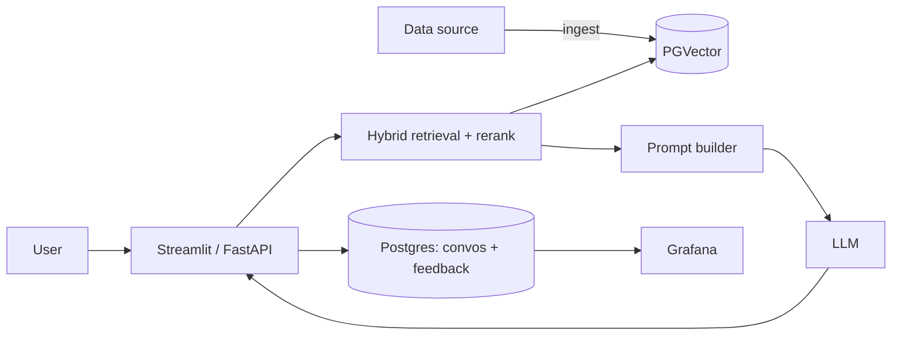

# Architecture

> TODO: describe how data flows through the system end to end. Embed
> `architecture.png` (export from Excalidraw / draw.io / Mermaid).

## Components

| Component | Module | Responsibility |
|-----------|--------|----------------|
| Ingestion (`app/ingest.py`) | 1, 3 | Download, clean, chunk, index the dataset |
| Knowledge base (PGVector) | 2 | Store documents + embeddings |
| Retrieval (`app/retrieval/`) | 1, 2, 6 | Keyword / vector / hybrid + rerank |
| RAG (`app/rag.py`) | 1 | Build prompt, call LLM, return grounded answer |
| Interface (`app/api.py`, `app/ui.py`) | 5, 7 | FastAPI + Streamlit |
| Storage (`app/db.py`) | 5 | Conversations + feedback in Postgres |
| Monitoring (`grafana/`) | 5 | Dashboards over the Postgres data |

## Flow

## Decisions

> TODO: note key choices (why PGVector, chunking strategy, model, etc.).
